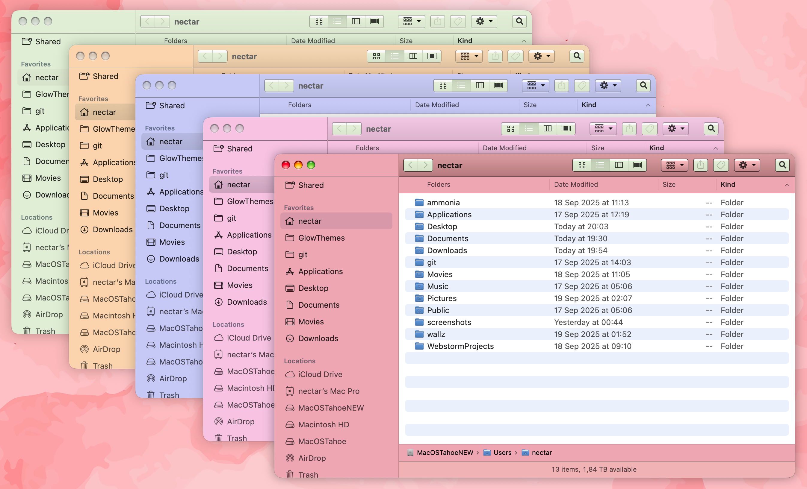

# 🎨 Glow Engine Colorizer Utility

A Python-based GUI application for colorizing macOS themes within the `Glow Engine Project`. Extract dominant colors from your wallpaper and apply them to theme elements with customizable intensity.

##  To get access to Glow Engine, join the Discord server:
##  https://discord.gg/QF2KEmku

## ✨ Features

-   🎨 Color Extraction: Automatically extract dominants colors from any image

-   ⚙️ Customizable Tinting: Adjust color intensity with slider/spinbox controls

-   🎯 Selective Processing: Choose which elements to tint (checkboxes, window frames)

-   💾 Theme Management: Create new themed variants or modify existing ones

-   🔒 Backup System: Automatic backup and restore functionality

-   🖱️ Drag & Drop: Intuitive drag-and-drop interface for wallpapers

## 📋 Prerequisites

-   Python 3.8+

-   pip (Python package manager)

-   macOS (designed for macOS theming)

## 🚀 Installation & Setup

### 1\. Download the App or the Project

### 2\. Create Python Virtual Environment

\# Create virtual environment
`python3 venv glow-env`

\# Activate the environment
`source glow-env/bin/activate`

### 3\. Install Dependencies

\# Install required packages
`pip install \-r requirements.txt`

### 4\. Run the Application

\# Run the colorizer

`python colorizer.py`

## 🏗️ Building Standalone Application

To create a standalone macOS app:

\# Ensure PyInstaller is installed
`pip install pyinstaller`

\# Run the build script
`chmod +x build.sh`
then
`./build.sh`

\# The application will be built in dist/ folder

## 🎮 How to Use

1.  Select Theme: On the interface, choose from existing themes in `/Library/GlowThemes/`

2.  Add Colors:

    -   Drag & drop your wallpaper onto the target area

    -   Or click to browse for an image

    -   Or manually enter a HEX color code

3.  Adjust Settings:

    -   Set intensity (0.0 - 1.0)

    -   Choose which elements to tint

    -   Decide whether to create new theme or modify existing

4.  Process: Click "Process Theme" to apply changes

5.  Restore: Use "Restore Backup" if needed

## 🔧 Technical Details

-   GUI Framework: PyQt5

-   Image Processing: Pillow (PIL)

-   Color Extraction: scikit-learn K-means clustering

-   File Operations: Native Python pathlib and shutil

## 🛠️ Development

### Adding New Features

1.  Make changes to `colorizer.py`

2.  Test functionality

3.  Update requirements if needed

4.  Rebuild with `./build.sh`

## 📝 License

This project is designed for personal use with Glow Themes on macOS.

## 🤝 Support

For issues or questions:

1.  Check that all dependencies are installed

2.  Ensure you have write permissions to `/Library/GlowThemes/`

3.  Verify your wallpaper images are in supported formats

* * *

Note: This utility is designed specifically for macOS theming using Glow Engine.